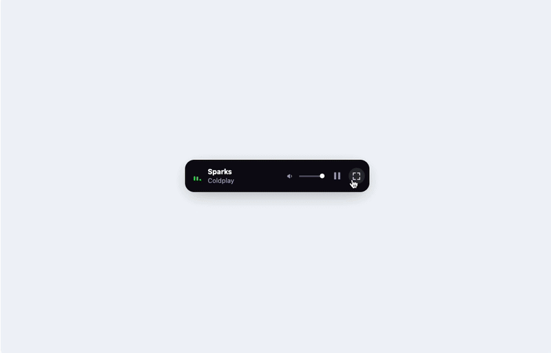

# react-youtube-jukebox

<p align="center">
  <a href="https://react-youtube-jukebox.com/">
    
  </a>
</p>

<p align="center">
  <a href="https://www.npmjs.com/package/react-youtube-jukebox"></a>
  <a href="https://www.npmjs.com/package/react-youtube-jukebox"></a>
  <a href="https://github.com/madisonrubylee/react-youtube-jukebox/blob/main/LICENSE"></a>
</p>

A floating YouTube player component for React. Drop it into your app and it sits in the corner playing music — like a jukebox.

It wraps the YouTube IFrame Player API and gives you a dock-style mini player, queue rotation, an expandable panel, and portal rendering out of the box. Styles are auto-injected, so there's no CSS to import.

**[Docs & Live Demo →](https://react-youtube-jukebox.com/)**

## Install

```bash
pnpm add react-youtube-jukebox
# or
npm i react-youtube-jukebox
```

## Usage

```tsx
import { Jukebox } from "react-youtube-jukebox";

const tracks = [
  { videoId: "yTg4v2Cnfyo", title: "Soul Below", artist: "Ljones" },
  { videoId: "s4MQku9Mkwc", title: "Something About Us", artist: "Daft Punk" },
];

export default function App() {
  return <Jukebox tracks={tracks} position="bottom-center" offset={20} />;
}
```

That's it. The player shows up at the bottom center of the viewport with a 20px margin.

### What you can configure

- **`position`** — `bottom-right` (default), `bottom-left`, `bottom-center`, `top-right`, `top-left`, `top-center`
- **`theme`** — `glass` (default), `simple`, `sunset`, `ride`
- **`chrome`** — `classic` (default), `wallet`, `ride` — changes the outer shell style
- **`offset`** — number or `{ x, y }` for fine-tuned spacing
- **`portal`** — renders via React portal by default. Set `false` to inline it
- **`autoplay`** — `true` by default (starts muted). Set `false` to disable
- **`renderExpandedContent`** — pass a render function to fully customize the expanded panel

Full props and types are documented at [react-youtube-jukebox.com/api-playground](https://react-youtube-jukebox.com/api-playground).

### Custom expanded panel

If the default expanded player doesn't fit your design, swap it out:

```tsx
import {
  Jukebox,
  type JukeboxExpandedRenderProps,
} from "react-youtube-jukebox";

function MyPanel({
  currentTrack,
  playerMountRef,
  togglePlay,
}: JukeboxExpandedRenderProps) {
  return (
    <div>
      <div ref={playerMountRef} style={{ aspectRatio: "16 / 9" }} />
      <p>{currentTrack.title}</p>
      <button onClick={togglePlay}>Play / Pause</button>
    </div>
  );
}

<Jukebox
  tracks={tracks}
  renderExpandedContent={(props) => <MyPanel {...props} />}
/>;
```

The library still handles visibility toggling and animations — you just define the inner layout.

## Monorepo structure

This repo is a pnpm workspace with two packages:

```
apps/docs/                    → Next.js docs site (react-youtube-jukebox.com)
packages/react-youtube-jukebox/ → the library (this is what gets published to npm)
```

Only `packages/react-youtube-jukebox` is published. Everything else is internal.

## Development

Node ≥ 18, pnpm ≥ 9.

```bash
git clone https://github.com/madisonrubylee/react-youtube-jukebox.git
cd react-youtube-jukebox
pnpm install
pnpm dev          # starts both the library watcher and the docs dev server
```

Other commands:

```bash
pnpm build        # build everything
pnpm lint         # eslint
pnpm typecheck    # tsc --noEmit
pnpm publish:check # dry-run npm pack
```

Tests live in the library package:

```bash
cd packages/react-youtube-jukebox
pnpm test
```

### Tech stack

|          |                                         |
| -------- | --------------------------------------- |
| Library  | React · TypeScript · YouTube IFrame API |
| Bundler  | tsup                                    |
| Docs     | Next.js App Router · Vercel             |
| Monorepo | pnpm workspaces                         |
| Test     | Vitest                                  |
| Lint     | ESLint flat config                      |

## Docs site

The docs app (`apps/docs`) is deployed to [react-youtube-jukebox.com](https://react-youtube-jukebox.com/). Pages: Home, Quick Start, API Playground, Examples, Showcase.

## Contributing

PRs and issues are welcome.

1. Fork → branch → commit → push → PR. That's it.

See [`docs/publish-flow.md`](docs/publish-flow.md) for the release process and [`docs/monorepo-plan.md`](docs/monorepo-plan.md) for architecture decisions.

## License

[MIT](LICENSE)

---

## 한국어

React용 플로팅 YouTube 플레이어 컴포넌트입니다. 앱에 넣으면 구석에 붙어서 음악을 틀어주는 주크박스예요.

YouTube IFrame Player API를 감싸서 독(dock) 스타일 미니 플레이어, 큐 순환, 확장 패널, 포털 렌더링을 기본 제공합니다. 스타일은 자동 주입되니까 CSS import 따로 안 해도 됩니다.

**[문서 & 라이브 데모 →](https://react-youtube-jukebox.com/)**

### 설치

```bash
pnpm add react-youtube-jukebox
# 또는
npm i react-youtube-jukebox
```

### 사용법

```tsx
import { Jukebox } from "react-youtube-jukebox";

const tracks = [
  { videoId: "yTg4v2Cnfyo", title: "Soul Below", artist: "Ljones" },
  { videoId: "s4MQku9Mkwc", title: "Something About Us", artist: "Daft Punk" },
];

export default function App() {
  return <Jukebox tracks={tracks} position="bottom-center" offset={20} />;
}
```

이게 끝입니다. 뷰포트 하단 가운데에 20px 마진으로 플레이어가 뜹니다.

### 설정 가능한 것들

- **`position`** — `bottom-right`(기본), `bottom-left`, `bottom-center`, `top-right`, `top-left`, `top-center`
- **`theme`** — `glass`(기본), `simple`, `sunset`, `ride`
- **`chrome`** — `classic`(기본), `wallet`, `ride` — 외곽 셸 스타일 변경
- **`offset`** — 숫자 하나 또는 `{ x, y }` 형태로 여백 조절
- **`portal`** — 기본 true(React 포털 렌더링). 인라인 배치할 때만 `false`
- **`autoplay`** — 기본 true(음소거 상태로 자동 재생). 끄려면 `false`
- **`renderExpandedContent`** — 확장 패널을 완전히 커스텀할 수 있는 렌더 함수

전체 props/타입은 [react-youtube-jukebox.com/api-playground](https://react-youtube-jukebox.com/api-playground)에서 확인할 수 있습니다.

### 커스텀 확장 패널

기본 확장 플레이어가 디자인에 안 맞으면 바꿀 수 있습니다:

```tsx
import {
  Jukebox,
  type JukeboxExpandedRenderProps,
} from "react-youtube-jukebox";

function MyPanel({
  currentTrack,
  playerMountRef,
  togglePlay,
}: JukeboxExpandedRenderProps) {
  return (
    <div>
      <div ref={playerMountRef} style={{ aspectRatio: "16 / 9" }} />
      <p>{currentTrack.title}</p>
      <button onClick={togglePlay}>Play / Pause</button>
    </div>
  );
}

<Jukebox
  tracks={tracks}
  renderExpandedContent={(props) => <MyPanel {...props} />}
/>;
```

토글 애니메이션이나 visibility는 라이브러리가 알아서 처리하니까, 안쪽 레이아웃만 만들면 됩니다.

### 모노레포 구조

이 저장소는 pnpm workspace로 두 패키지를 관리합니다:

```
apps/docs/                      → Next.js 문서 사이트 (react-youtube-jukebox.com)
packages/react-youtube-jukebox/ → 라이브러리 본체 (npm에 배포되는 패키지)
```

npm에 배포되는 건 `packages/react-youtube-jukebox`뿐입니다. 나머지는 내부용.

### 개발

Node ≥ 18, pnpm ≥ 9 필요합니다.

```bash
git clone https://github.com/madisonrubylee/react-youtube-jukebox.git
cd react-youtube-jukebox
pnpm install
pnpm dev          # 라이브러리 워처 + 문서 사이트 dev 서버 동시 실행
```

기타 명령어:

```bash
pnpm build        # 전체 빌드
pnpm lint         # eslint
pnpm typecheck    # tsc --noEmit
pnpm publish:check # dry-run npm pack
```

테스트는 라이브러리 패키지 안에 있습니다:

```bash
cd packages/react-youtube-jukebox
pnpm test
```

### 기술 스택

|            |                                         |
| ---------- | --------------------------------------- |
| 라이브러리 | React · TypeScript · YouTube IFrame API |
| 번들러     | tsup                                    |
| 문서       | Next.js App Router · Vercel             |
| 모노레포   | pnpm workspaces                         |
| 테스트     | Vitest                                  |
| 린트       | ESLint flat config                      |

### 문서 사이트

문서 앱(`apps/docs`)은 [react-youtube-jukebox.com](https://react-youtube-jukebox.com/)에 배포됩니다. 페이지 구성: Home, Quick Start, API Playground, Examples, Showcase.

### 기여

PR, 이슈 환영합니다.

1. Fork → 브랜치 → 커밋 → 푸시 → PR. 끝.

릴리즈 프로세스는 [`docs/publish-flow.md`](docs/publish-flow.md), 아키텍처 결정 사항은 [`docs/monorepo-plan.md`](docs/monorepo-plan.md)를 참고하세요.

### 라이선스

[MIT](LICENSE)
